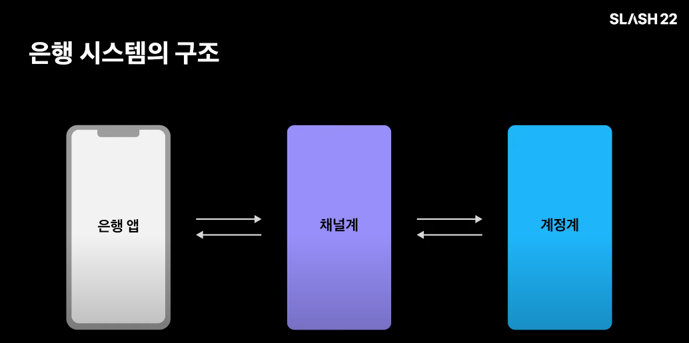
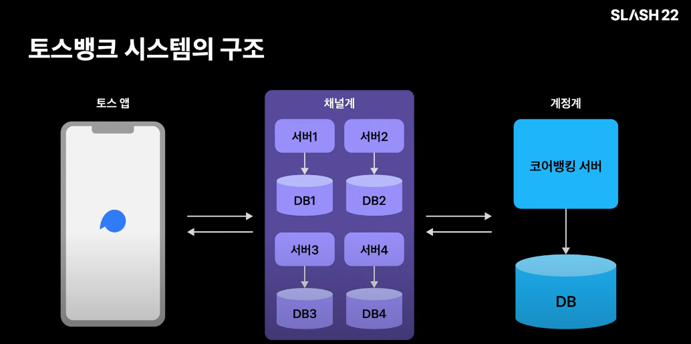
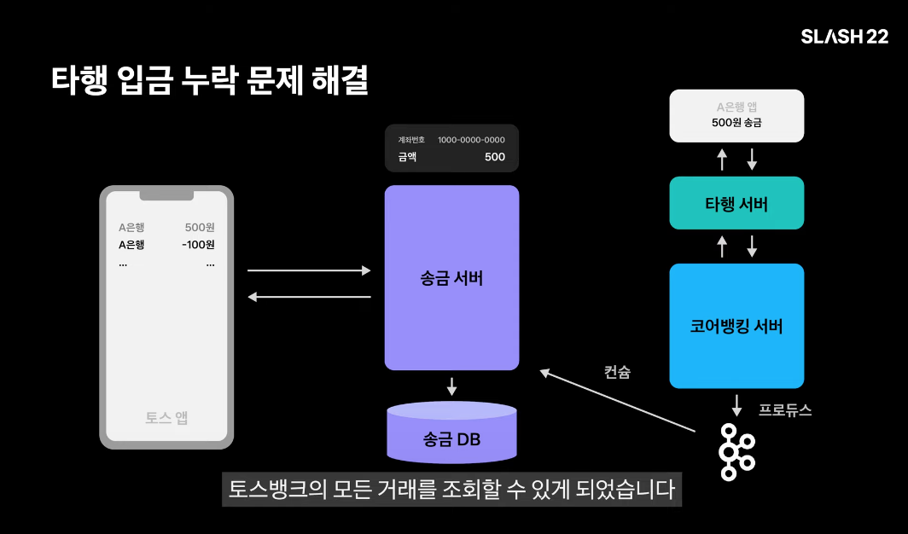

# SLASH 22 - 은행은 왜 무한스크롤이 안되나요?

- 은행의 거래내역은 왜 항상 짧은 기간에서만 조회되고, 무한 스크롤로 개발할 수 없는걸까?
- 일반적으로 은행은 채널계과 계정계로 분리된다.
    - 계정계는 실제 사용자의 돈을 다루며, 원본 데이터가 저장되는 영역이다. 장애가 나면 안되며, 아주 높은 신뢰도가 요구된다.
    - 채널계는 유저의 요청을 직저 받아 처리하는 영역이다. 돈을 직접다루지는 않고 그런 요청은 계정계로 전달하여 처리한다.
- 거래내역은 은행에서 매우 핵심적인 기록이기 떄문에 계정계에서 처리한다.
    - 채널계는 고객의 거래내역 조회 요청을 받아 계정계에 전달하고 그 결과를 다시 앱으로 전달한다.
    - 계정계는 성능보다 신뢰도가 우선이기 때문에 광범위한 거래내역 조회를 빠른시간에 낮은 응답시간으로 응답해주기는 어렵다..
- 토스에서는 어떻게 해결하고 있을까?
    - 사실 토스에서는 거래내역 조회를 할 때마다 계정계의 코어뱅킹 서버에 요청을 보내지 않는다.
    - 채널계에 있는 송금 서버가 거래내역을 직접 반환한다.
    - 이렇게 되면 항상 송금 서버가 코어뱅킹 서버와 거래내역을 정확하게 동기화하는 문재를 해결해야한다.
- 그렇다면 차근차근 문제를 풀어보자
    1. 일단 그냥 이체를 실행할 때 마다 이체 내역을 송금 서버 DB에 저장한다.
        - 다른 은행 앱을 이용해 토스뱅크에 입금한 것은 조회가 안된다.
        - 코어뱅킹 서버가 입금되었다는 사실을 송금 서버에게 알려줘야한다.
        - kafka를 이용하자.
        - 하지만 이 것은 모든 것이 이상적으로 동작해야 가능하다.
    2. 송금을 실행하는 도중 코어뱅킹 서버의 응답이 늦어져 타임아웃으로 송금 서버가 응답을 받지 못한다면?
        - 송금 서버는 거래내역을 DB에 저장할 수 없음, 송금이 성공했더라도 해당 거래내역을 볼 수 없음
        - 송금 서버에서 타임아웃이 발생하고, 송금이 완료되었다, 코어뱅킹 서버가 kafka를 통해 이체 실행 결과를 알려주면
    3. **하지만 여전히 큰 문제가 있음** 타임아웃 에러를 만난 유저가 송금이 실패한 줄 알고 다시 송금한다면?
        - 송금 요청이 들어오면, 송금 서버는 코어뱅킹 서버에 송금 요청을 보내기 전에, 우선 송금 요청을 DB에 저장한다.
        - 그리고 완료되지 않은 송금 요청이 있는 유저가, 다시 송금을 요청하면 거절한다.
        - 나중에 송금이 완료되어 송금서버가 송금 이력을 저장까지 끝내고 나면, 그 때부터 새로운 송금 요청을 수락할 수 있다.
        - 하지만 이 경우에도 문제가 있다.. **송금이 영원히 지연될 수 있는 문제**
    4. 만약 네트워크로 문제 등으로 인해 송금 서버가 코어뱅킹 서버에 보낸 송금 요청이 코어뱅킹 서버에 도달하지 못한다면?
        - 여전히 진행 중인 상태로 송금 DB에 남게 됨.. 그러면 유저는 영원히 송금을 할 수 없음
        - 이 문제를 피하기 위해 송금 서버는 주기적으로 코어뱅킹 서버에게 송금 요청 상태를 확인한다.
        - 이 케이스에서는 송금 요청이 코어뱅킹 서버에 도달하지도 못했으므로 코어뱅킹은 해당 송금을 전혀 모른다.
        - 따라서 송금 서버가 송금 상태를 조회하면, 코어뱅킹 서버는 송금 요청이 없었다고 응답할 것이다.
        - 그러면 송금 서버는 송금 요청을 코어뱅킹 서버에 전덜하는데 실패한 것으로 보고 송금 실패로 처리한다.
        - 그럼 이제 지연된 송금이 없으므로 유저는 계속해서 송금을 할 수 있다.
    5. 그런데 아주 희박한 가능성이지만 이 실패 처리가 잘못되어 성공을 실패로 처리해버릴 가능성이 있다.
        - 송금 서버가 지연된 송금의 상태를 코어뱅킹 서버에게 물어보고 코어뱅킹 서버가 그런 송금 건은 없다고 응답해서 실패한걸로 처리해 버렸는데..
        - 뒤늦게 송금 요청이 코어뱅킹 서버에 도달해 성공적으로 송금이 성공하는 경우입니다.
        - 예를 들어, 네트워크 무언가 이상이 생겨 송금 요청이 코어뱅킹 서버에게 도달하는게 지연되고 있는데,
        - 그 사이에 송금 서버의 송금 상태 조회 요청이 먼저 코어뱅킹 서버에 도착하게 되면
        - 코어뱅킹 서버는 송금 요청이 없었다고 응답할 것이고, 송금 서버는 송금 실패로 처리할 것이다.
        - 그런데 뒤늦게 송금 요청이 코어뱅킹 서버에 도달하게 됨녀, 그대로 송금 요청이 실행될 것이다.
        - 이 문제는 타임아웃 시간을 약속하고, 그보다 오래된 요청은 거절하는 방법으로 해결한다.
        - 송금 서버와 코어뱅킹 서버가 서로 타임아웃 시간을 1분으로 약속하고 송금 서버는 송금 요청을 보낼때 요청 시각을 포함시켜서 보낸다.
        - 타임아웃 시간이 지났는데 코어뱅킹 서버로부터 송금 완료 메시지가 오지 않으면 송금 서버는 코어뱅킹 서버에 송금 상태를 물어본 뒤 없음 응답이 오면 실패로
          처리한다.
        - 송금 요청이 뒤늦게 코어뱅킹 서버에 도달하면 요청 시각을 보고 타임아웃 시간이 지났다면 처리하지 않고 거절한다.
        - 이제 송금 실행과 관련된 예외 상황은 해결!
    6. 아직 이체 내역 관련 동기화와 관련해 몇 가지 남아있는 문제가있다....
- [영상링크](https://www.youtube.com/watch?v=v9rcKpUZw4o)

## 아키텍쳐

- 아키텍쳐는 아래와 같다.
- 계정계에서 코어뱅킹 로직을 처리하고 거래내역은 채널계와 동기화되어, 은행앱은 채널계에서 거래내역을 조회한다.
- 이 때 발생할 수 있는 여러 문제들을 처리해보자.
  

상세한 아키텍쳐는 아래와 같다.

- 

- 계정계는 하나의 애플리케이션, 하나의 DB로 이루어져 네트워크 구조가 단순하고, 트랜잭션 처리가 유리하다.
- 급증하는 트래픽에 대응은 어려우나, 계정계는 오류 없이 동작하는 것이 매우 중요하기 때문에 성능을 희생하더라도 이런 아키텍쳐를 택하게 된다.

## 코어뱅킹과 송금서버의 이체 내역 동기화

- 이체내역을 동기화 하기 위해, 코어 뱅킹 서버가 이체 내역을 kafka로 프로듀스 한다.
- 송금 서버는 이체 내역을 컨슘하여 송금 DB에 저장한다.

## 마일스톤

- [ ] 1번까지 문제를 풀어보자
    - [ ] spring cloud eureka, spring cloud openfeign 설정하여 서버간 통신

## docker kafka 설정법.. 어렵네

- https://taaewoo.tistory.com/